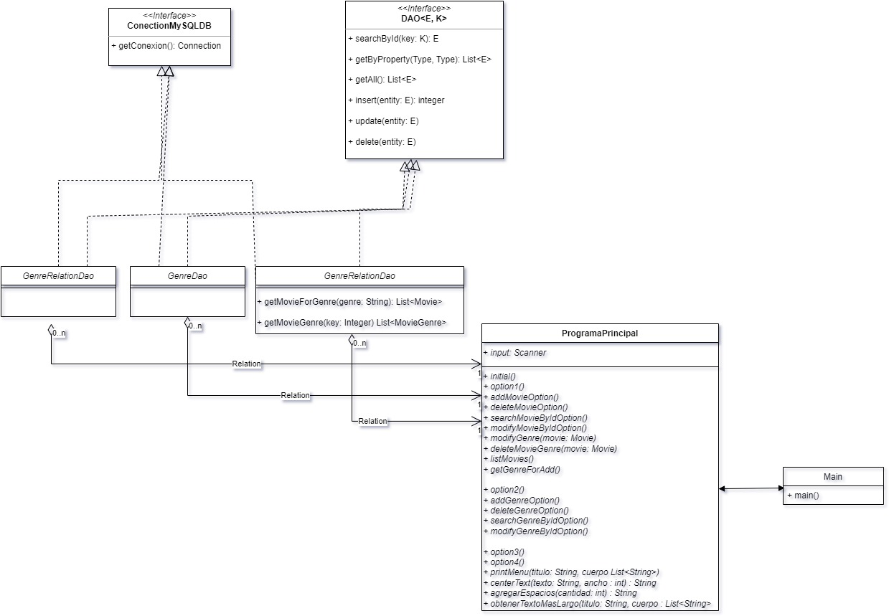
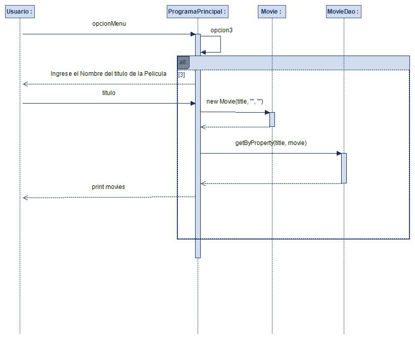
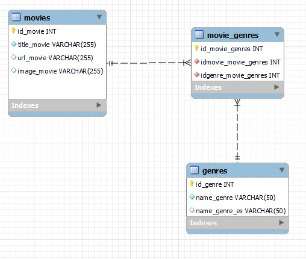

[✔]: assets/images/checkbox-small-blue.png


<h1 align="center">
  Primer Integrado BootCamp Java Fase 1
</h1>
<br/>


<br/>

## Tabla de Contenido

  <summary>
    <a href="#1-consigna">1. Consigna</a>
  </summary>
  
  <summary>
    <a href="#2-diagrama-uml">2. Diagrama UML</a>
  </summary>
  
  <summary>
    <a href="#3-diagrama-secuencia">3. Diagrama de Secuencia</a>
  </summary>
  
  <summary>
    <a href="#4-estructura-sql">4. Estructura base de datos</a>
  </summary>
  
  <summary>
    <a href="#5-query-sql">5. Query SQL</a>
  </summary>
  
  <summary>
    <a href="#6-autor">6. Autor</a>
  </summary>

## 🚀 Para realizar el Proyecto Integrador te propongo realizar los siguientes pasos...

# `1. Consigna`

 [✔] **1. Crear repositorio git:**
  - *Crearemos la cuenta en github.*
  - *Crearemos el repositorio.*

[✔] **2. Generar localmente el proyecto y subir el esqueleto al repositorio previamente creado:**

  - *Usaremos create-java-app.*
  - *Repasamos los comandos de git.*

[✔] **3. Diseñar un diagrama de clases de una aplicación que permita buscar películas por su título o su género. Cada película consta de un código, un título, una url hacia el sitio oficial de la película, una imagen promocional y uno o varios géneros.**

[✔] **4. Una vez que se realiza la búsqueda por alguno de los criterios (título – género) se debe mostrar en pantalla el listado de películas (solo su código y titulo) y permitir ingresar un código en particular, para ver toda la información detallada de la película seleccionada.**

[✔] **5. Para el desarrollo del proyecto usar Proyectos Maven – colecciones – separación en paquetes.**

[✔] **6. Utilizar una base de datos, crear las tablas correspondientes para realizar el ABM de películas. Adjuntar en el proyecto el script que crea la base de datos y las tablas usadas en el proyecto.**

[✔] **7. Aplicar el patrón de diseño DAO y realizar la búsqueda de películas, la obtención de una película por código y el ABM de películas contra la base de datos.**

[✔] **8. Realizar un diagrama de secuencias que represente la búsqueda de una película por nombre o género.**

[✔] **9. Trabajar con Git de tal manera de ir generando diferentes ramas que representen las diferentes features que se van cumpliendo, que se van uniendo a la rama principal que finalmente representa el proyecto completo.**

[✔] **10. Se pide investigar el uso de Markdown para editar el archivo readme.md para que brinde una descripción del proyecto a realizar, las tecnologías aplicadas, el script de la base de datos, la versión de java utilizada, el diagrama de clases y el diagrama de secuencias, el autor del
proyecto y un enlace a una red social del autor, preferentemente linkedin**
<br/><br/>

# `2. Diagrama UML`

<br/><br/>

# `3. Diagrama Secuencia`

<br/><br/>

# `4. Estructura SQL`

<br/><br/>

# `5. Query SQL`
```sql
CREATE DATABASE IF NOT EXISTS `movie_db`;
USE `movie_db`;

CREATE TABLE IF NOT EXISTS `genres` (
  `id_genre` int NOT NULL AUTO_INCREMENT,
  `name_genre` varchar(50) NOT NULL,
  `name_genre_es` varchar(50) DEFAULT NULL,
  PRIMARY KEY (`id_genre`),
  UNIQUE KEY `id_genres_UNIQUE` (`id_genre`)
) ENGINE=InnoDB AUTO_INCREMENT=26 DEFAULT CHARSET=utf8mb4 COLLATE=utf8mb4_0900_ai_ci;

CREATE TABLE IF NOT EXISTS `movies` (
  `id_movie` int NOT NULL AUTO_INCREMENT,
  `title_movie` varchar(255) CHARACTER SET utf8mb4 COLLATE utf8mb4_0900_ai_ci NOT NULL,
  `url_movie` varchar(255) DEFAULT NULL,
  `image_movie` varchar(255) DEFAULT NULL,
  PRIMARY KEY (`id_movie`),
  UNIQUE KEY `idmovies_UNIQUE` (`id_movie`)
) ENGINE=InnoDB AUTO_INCREMENT=14 DEFAULT CHARSET=utf8mb4 COLLATE=utf8mb4_0900_ai_ci;

CREATE TABLE IF NOT EXISTS `movie_genres` (
  `id_movie_genres` int NOT NULL AUTO_INCREMENT,
  `idmovie_movie_genres` int NOT NULL,
  `idgenre_movie_genres` int NOT NULL,
  PRIMARY KEY (`id_movie_genres`),
  UNIQUE KEY `idmovie_genres_UNIQUE` (`id_movie_genres`),
  KEY `id_movie` (`idmovie_movie_genres`),
  KEY `id_genre` (`idgenre_movie_genres`),
  CONSTRAINT `id_genre` FOREIGN KEY (`idgenre_movie_genres`) REFERENCES `genres` (`id_genre`) ON DELETE CASCADE,
  CONSTRAINT `id_movie` FOREIGN KEY (`idmovie_movie_genres`) REFERENCES `movies` (`id_movie`) ON DELETE CASCADE
) ENGINE=InnoDB AUTO_INCREMENT=63 DEFAULT CHARSET=utf8mb4 COLLATE=utf8mb4_0900_ai_ci;
```
<br/><br/>
# `6. Autor`
[Juan Mercado](https://github.com/juan86) <a href="https://www.linkedin.com/in/juan-mercado-0aba7a68/"></img></a>
💻 Programador